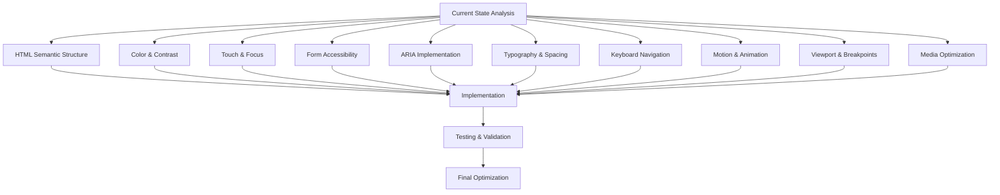

# Mobile Accessibility Refactoring Plan for Finemesh Labs

## Overview
This plan outlines a comprehensive refactoring approach to improve mobile accessibility and responsive design for the Finemesh Labs coming soon page. The focus is on creating an inclusive experience that works well for all mobile users, including those with disabilities.

## Mobile Accessibility Refactoring Workflow

## Detailed Implementation Plan

### 1. Semantic HTML Structure
- Convert generic divs to semantic elements (header, main, section, footer)
- Ensure proper heading hierarchy (h1 → h2 → h3)
- Add skip navigation links for screen readers
- Implement proper document outline

### 2. Color & Contrast Enhancement
- Increase contrast ratios to meet WCAG AA standards (4.5:1 for normal text)
- Ensure interactive elements have sufficient contrast in all states
- Add focus indicators with high contrast
- Test color combinations in various mobile display conditions

### 3. Touch & Focus Management
- Increase minimum touch target size to 44x44px (Apple HIG)
- Add visible focus states for all interactive elements
- Implement proper focus trapping for modals
- Ensure focus order matches visual layout

### 4. Form Accessibility Improvements
- Add proper label associations with for/id attributes
- Implement inline error messages with aria-describedby
- Add fieldset and legend for form groups
- Include form validation announcements for screen readers

### 5. ARIA Implementation
- Add landmark roles (banner, main, contentinfo, navigation)
- Implement aria-live regions for dynamic content
- Add aria-expanded for collapsible content
- Include aria-label for icon-only buttons

### 6. Responsive Typography
- Implement fluid typography using clamp() function
- Ensure line height is at least 1.5 for body text
- Add proper spacing between paragraphs and headings
- Optimize font sizes for mobile reading distances

### 7. Keyboard Navigation
- Ensure all interactive elements are keyboard accessible
- Add visible keyboard focus indicators
- Implement proper tab order
- Add keyboard shortcuts for common actions

### 8. Motion & Animation
- Respect prefers-reduced-motion media query
- Add pause controls for animations
- Ensure animations don't interfere with reading
- Provide alternatives for motion-dependent interactions

### 9. Viewport & Breakpoints
- Optimize viewport meta tag for mobile devices
- Implement responsive breakpoints based on content, not devices
- Add orientation-specific styles
- Ensure proper scaling across devices

### 10. Media Optimization
- Add appropriate alt text for all images
- Implement responsive images with srcset
- Optimize social media icons for different densities
- Add loading="lazy" for non-critical images

## Testing Strategy
- Test with mobile screen readers (VoiceOver, TalkBack)
- Validate with automated accessibility tools
- Test on actual mobile devices with various screen sizes
- Perform touch gesture testing
- Test with external keyboard on mobile devices

## Success Metrics
- WCAG 2.1 AA compliance for mobile
- Improved touch target compliance (100% of targets ≥44px)
- Color contrast ratio ≥4.5:1 for all text
- Proper heading structure (no skipped levels)
- All form elements properly labeled
- Keyboard accessibility for all interactive elements